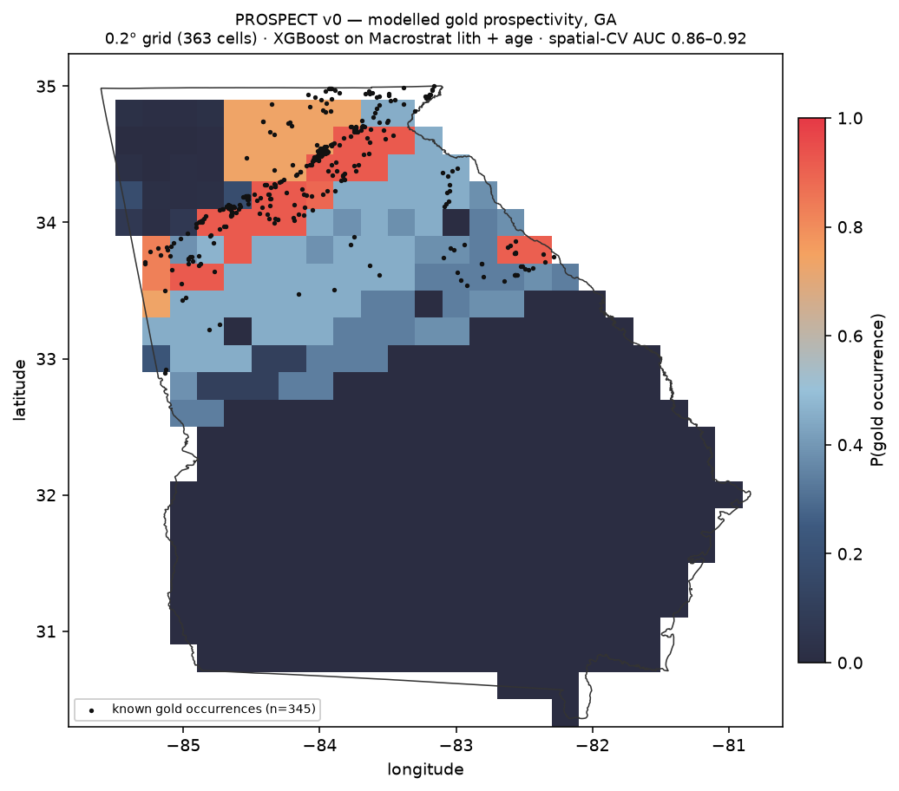

# PROSPECT

Predicting where gold occurs in Georgia from public geologic data, and being
honest about how well that works.

The pipeline takes USGS mineral-occurrence records and Macrostrat geologic map
units, learns which rock types and ages host known gold, and scores a grid over
the whole state. The output is a ranked "go look here" list and a heatmap.

> v0 target was garnet; pivoted after label forensics returned N=1 as a
> commodity. See `DECISIONS.md` #9. The pipeline is mineral-agnostic and
> state-agnostic — Georgia is an instance, passed as an argument, not an
> assumption baked into the code.



## The honest numbers

Spatial-block cross-validation, 5-fold, XGBoost (depth 3, 300 trees, seed 42):

| Validation scheme | Blocks | AUC | What question it answers |
|---|---|---|---|
| random KFold | 854 | 0.927 ± 0.009 | *nothing useful — see below* |
| 0.1° blocks (~9 km) | 517 | 0.925 ± 0.023 | interpolate between neighbours |
| 0.25° blocks (~23 km) | 223 | 0.928 ± 0.022 | ” |
| **0.5° blocks (~46 km)** | 69 | **0.919 ± 0.049** | **score GA with training points scattered nearby — how the map below is actually used** |
| **1.0° blocks (~93 km)** | 24 | **0.857 ± 0.043** | **generalise to a region held out entirely** |
| 2.0° blocks (~186 km) | 8 | 0.815 ± 0.049 | *too few blocks to quote* |

Two numbers are bolded because they answer different questions and quoting
either one alone would be misleading. Baseline: AUC 0.500, average precision
0.404 (the positive-class prevalence).

**Why not a random train/test split?** Mineral occurrences are spatially
autocorrelated. A point 200 m from a known mine sits in the *same map unit*, so
it carries the same lithology and the same age. Shuffle those into different
folds and the "held out" point is one the model has already seen, feature for
feature, label included. Random CV measures interpolation between neighbours.
Nobody wants to know that.

**The result I did not expect.** The random-vs-blocked gap at fine scales is
about 0.008 AUC — essentially nothing. The naive reading is "no leakage here."
That reading is wrong. The gap is small at 9–46 km because *the features are
map-unit-level*: a 0.1° block contains the same geologic units as its
neighbours, so blocking at that scale removes no information the model was
using. The autocorrelation length is the size of a map unit, which is large.
The model's skill is regional, and only blocks big enough to hold out whole
regions expose it — hence 0.919 → 0.815 as blocks grow. Small gap, real
leakage, at a scale finer CV cannot see.

Excluding raw latitude/longitude from the feature set is what makes that gap
honest. With coordinates in `X` the model would memorise locations and the
whole curve would collapse. See `DECISIONS.md` #14 and #16.

## What the model actually learned

Ablation under 0.5° spatial blocks:

| Features | n | AUC |
|---|---|---|
| age only | 3 | 0.869 ± 0.038 |
| lithology only | 10 | 0.716 ± 0.065 |
| age + lithology | 13 | 0.919 ± 0.049 |

Top importances: `b_age` (0.49), `age_mid` (0.18), `lith_volcanic` (0.14).

Georgia gold lives in old crystalline rock — the Dahlonega belt of the
Piedmont and Blue Ridge — so `b_age` doing most of the work is geologically
correct. `lith_volcanic` is the interesting one: Macrostrat's coarse
"volcanic: interlayered sedimentary and volcanic rocks" *is* the Dahlonega
metavolcanic sequence under a low-resolution name.

## Honest limitations

**1. The lithology features are weaker than they look.** The map source
covering ~87 % of positives has no metamorphic vocabulary at all — it calls
gold-belt metasediments "sedimentary." So `lith_quartz` fires on zero rows and
`lith_schist` on one, out of 854. Quartz-vein-in-schist is the actual host rock
for Georgia gold and the model cannot see it. This is a data-resolution
problem, not an encoding problem (`DECISIONS.md` #8).

**2. Statewide AUC is partly a Fall Line detector.** All 345 positives fall in
the crystalline province; the Coastal Plain contributes 303 negatives and zero
positives. Restricting to the crystalline province and re-running gives
**AUC 0.804 ± 0.101** on 345 pos / 206 neg. That is real discrimination inside
gold country rather than mere province separation — but it is the number that
matters for "where in the gold belt should I go," and it is lower than 0.919.

**3. Negatives are pseudo-absences, not verified absences.** This is a
positive-unlabelled problem dressed as binary classification. The method is
only valid because gold-bearing ground is a small fraction of Georgia — with
no buffer at all, only ~4 of 1000 random points land near a known occurrence.
That precondition was verified, not assumed, and it would fail for an abundant
target like granite (`DECISIONS.md` #10).

**4. MRDS records where industry looked, not where gold is.** Absence of a
record near a road is different from absence of gold. Sampling bias in the
labels propagates straight into the map.

**5. No field validation yet.** One trip to a high-probability cell is planned;
the writeup happens either way.

## Pipeline

```
data/raw/mrds-GA.csv ─┐
                      ├─> positives_gold.csv ─┐
GA polygon ───────────┴─> pseudo_absences.csv ┴─> training_table_v0.csv
                      (Macrostrat point lookups, cached)        │
                                                                ▼
                                          spatial-block CV ─> metrics_v0.json
                                                                │
0.1° GA grid ─> Macrostrat lookups ─> grid_GA_0.1.csv ─> scored ┴─> heatmap
```

```bash
pip install -r requirements.txt
python scripts/build_training_table.py     # merge, dedupe, featurize, validate
python scripts/train_model.py              # spatial CV, ablation, metrics
python scripts/build_grid.py --step 0.1    # ~18 min, resumable, cached
python scripts/render_map.py --step 0.1    # HTML + PNG
```

Reproducible: seed 42 throughout, every Macrostrat response cached to disk and
never re-queried, all paths relative to the repo root via `pathlib`.

## Design notes

Two things in here are load-bearing and easy to get wrong.

**The feature contract** (`src/prospect/features.py`). An explicit allowlist of
what may enter `X`, plus a blocklist with a stated reason per column, enforced
in code as a fatal build error. The tempting mistake this prevents:
`age_span` (`b_age - t_age`) separates the classes beautifully — median 514.6
on one map source versus 1.12 on another — because it is a *dating-confidence*
metric that tracks which map covered the point, and map coverage correlates
with the label (one source is 240 negatives to 1 positive). It is provenance
wearing a geology costume, and it would have bought several free AUC points.

**The validation layer** (`src/prospect/checks.py`). Deterministic tripwires
that abort the build: a blocked feature in `X`, duplicate coordinates,
non-binary labels, non-OK rows surviving the status filter. Plus an advisory
univariate-AUC guard that flags any single feature scoring above 0.90 — which
is how a provenance proxy gets caught automatically instead of by luck. It is
advisory rather than fatal on purpose: a feature *can* legitimately separate
the classes, since old crystalline rock really does host Georgia gold.

Every decision, including the ones that were tested and rejected, is in
`DECISIONS.md` with what was chosen, why, and what was turned down.

## Data sources & attribution

- **USGS Mineral Resources Data System (MRDS)** — U.S. Geological Survey,
  public domain. https://mrdata.usgs.gov/mrds/
- **Macrostrat** — University of Wisconsin–Madison, CC-BY 4.0.
  https://macrostrat.org
- **State boundaries** — U.S. Census Bureau cartographic boundary files.

## AI assistance

Sessions A–B (data layer) were authored by the repo owner. Sessions C–F
were built by Claude (Opus 5) under an instruction to run to v0 autonomously;
`DECISIONS.md` entries from that work are marked `[AUTONOMOUS]` and dated, so
the record reflects who reasoned what.
